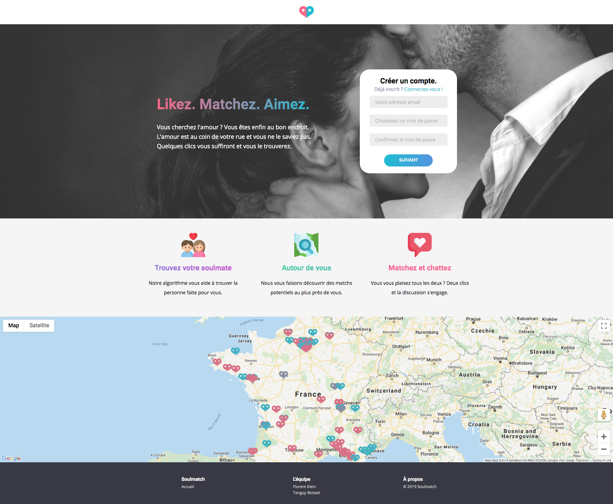
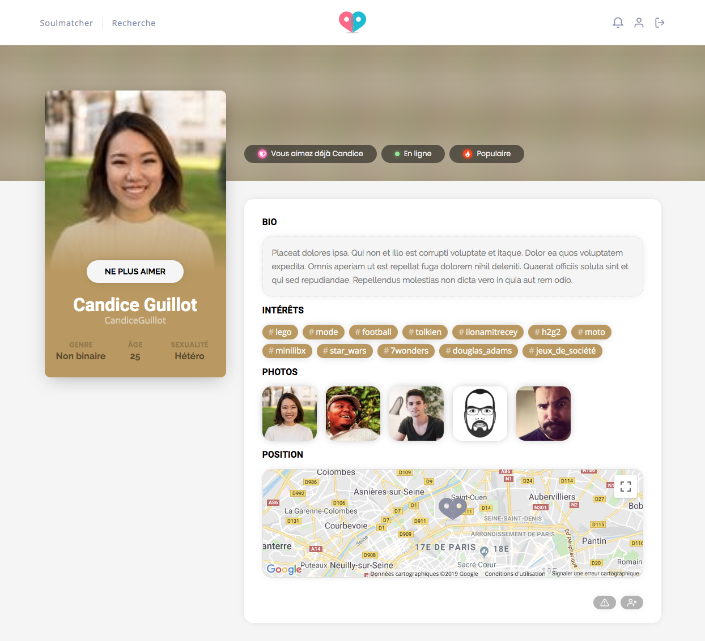

# Matcha

> *Hi! We are **Tanguy Boissel-Dallier** and **[Florent Klein](https://fkle.in/)**. This is our work on 42's project "**Matcha**".*


## Soulmatch
**Soulmatch** is a complete dating site, with:
- matching algorithm
- advanced search
- profile pages
- live chat
- instant notifications
- complete fake profiles seeding
- user geolocation
- responsive for mobile

We are using:
- React
- Node.js, with Express
- MySQL
- WebSocket
- GoogleMaps API

## Installation
Clone the repo:
```bash
git clone https://github.com/floklein/Matcha.git && cd Matcha
```

Install the `node_modules` and setup the database:
```bash
npm i && npm run client-install && npm run init
```

Run the server:
```bash
npm run dev
```

In an other terminal, while the server is running, run the seeder:
```bash
npm run seeder
```

## Design
**Soulmatch** does not use any CSS frameworks. Its design is completly homemade.


|                         |                         |
|:-----------------------:|:-----------------------:|
|  |  |
| **Matching** page           | **User profile** & **live chat**|
|  |  |
| **Advanced search** page & **live notifications**    | **Profile edit** & **account menu** |
|  |  |
| **Home** page, ***on mobile***    | |
